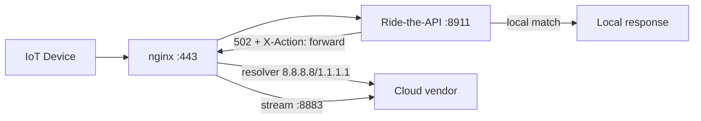

# Deployment Guide — Ride-the-API

> Local cloud replacement proxy: intercepts IoT traffic, learns protocols
> via LLM and responds locally.

## Table of Contents

- [Direct Execution](#direct-execution-python--m-coreserverpy)
- [Docker](#docker)
- [Docker Compose with nginx Sidecar](#docker-compose-with-nginx-sidecar)
- [Volumes and Persistence](#volumes-and-persistence)
- [Networks](#networks)
- [Environment Variables](#environment-variables)
- [GPU Support](#gpu-support)
- [Systemd (Linux)](#systemd-linux)
- [Troubleshooting](#troubleshooting)

---

## Direct Execution (`python -m core.server`)

Suitable for development or single host without containers.

### Prerequisites

- Python ≥ 3.11
- Pip / uv
- Git

### Installation

```bash
# Clone the repository
git clone https://github.com/thcuba/Ride-the-api.git
cd Ride-the-api

# Create and activate a virtual environment
python3 -m venv .venv
source .venv/bin/activate  # Linux/macOS
# .venv\Scripts\activate   # Windows

# Install the package in editable mode
pip install -e .
```

### Configuration

```bash
# Copy the example configuration file
cp config/config.yaml config/config.yaml  # already present

# Edit config/config.yaml:
# - Set the LLM API key (OpenAI-compatible)
# - Configure vendors and their cloud endpoints
# - Adjust the learning mode
```

The `config/config.yaml` file follows the structure documented in [configuration.md](configuration.md).

### Startup

```bash
python -m core.server
```

The server starts on `http://0.0.0.0:8911` (configurable in `config.yaml`).

### DNS Setup (required for interception)

To intercept IoT device traffic, you must point their cloud domains to the
proxy's IP address. Recommended methods:

#### dnsmasq

```bash
# /etc/dnsmasq.d/ride-api.conf
address=/mqtt.example.com/192.168.1.100
address=/api.example.com/192.168.1.100

sudo systemctl restart dnsmasq
```

#### Pi-hole / AdGuard Home

Add custom rewrites:
```
mqtt.example.com → 192.168.1.100
api.example.com  → 192.168.1.100
```

#### iptables (alternative)

If you cannot modify DNS, redirect ports directly:

```bash
iptables -t nat -A PREROUTING -d 192.168.1.100 -p tcp --dport 443 -j REDIRECT --to-port 8911
iptables -t nat -A PREROUTING -d 192.168.1.100 -p tcp --dport 8883 -j REDIRECT --to-port 8911
```

---

## Docker

### Building the image

```bash
# CPU (default)
docker build -f deploy/Dockerfile -t ride-the-api:latest .

# GPU (NVIDIA CUDA)
docker build --target=production-gpu -f deploy/Dockerfile -t ride-the-api:gpu .
```

The multi-stage Dockerfile offers three targets:

| Target | Description |
|--------|-------------|
| `base` | Python dependencies + compilation |
| `gpu` | Base + CUDA 12.4, TensorRT, ONNX Runtime GPU |
| `production` | **(default)** Minimal production image (CPU) |
| `production-gpu` | Production with GPU |

### Running a single container

```bash
# Create directories for persistent data
mkdir -p data/devices data/core certs models logs

# Start the container
docker run -d \
  --name ride-the-api \
  --restart unless-stopped \
  -p 8911:8911 \
  -p 8080:8080 \
  -v "$(pwd)/config:/app/config:ro" \
  -v "$(pwd)/data:/app/data" \
  -v "$(pwd)/certs:/app/certs:ro" \
  -v "$(pwd)/models:/app/models:ro" \
  -v "$(pwd)/logs:/app/logs" \
  -e LOG_LEVEL=INFO \
  -e CONFIG_PATH=/app/config/config.yaml \
  ride-the-api:latest
```

### Health check

The container exposes an automatic health check every 30 seconds at `http://localhost:8911/health`.

Ports exposed by the container:

| Port | Usage |
|------|-------|
| 8911 | Main proxy (traffic interception) |
| 8080 | Health check / dashboard |
| 9090 | Prometheus metrics |

---

## Docker Compose with nginx Sidecar

The recommended architecture for production includes an nginx reverse proxy as a sidecar.
nginx handles:

1. TLS termination (port 443)
2. Routing device traffic to Ride-the-API (internal port 8911)
3. Forwarding misses to the cloud vendor via a dedicated DNS resolver (8.8.8.8 / 1.1.1.1),
   **avoiding DNS loops** with the local DNS (dnsmasq / Pi-hole)

### Startup

```bash
docker compose -f deploy/docker-compose.yml up -d
```

### Services

#### `ride-the-api` (main server)

```yaml
ride-the-api:
  build:
    context: ..
    dockerfile: deploy/Dockerfile
  container_name: ride-the-api
  restart: unless-stopped
  ports:
    - "8080:8080"      # Health/dashboard (optional, remove for security)
  volumes:
    - ../config:/app/config:ro
    - ../data:/app/data
    - ../certs:/app/certs:ro
    - ../models:/app/models:ro
    - ../logs:/app/logs
  environment:
    - PYTHONUNBUFFERED=1
    - LOG_LEVEL=INFO
    - CONFIG_PATH=/app/config/config.yaml
```

#### `nginx` (reverse proxy sidecar)

```yaml
nginx:
  image: nginx:alpine
  container_name: ride-the-api-nginx
  restart: unless-stopped
  ports:
    - "80:80"
    - "443:443"
    - "8883:8883"      # MQTT over TLS (stream proxy)
  volumes:
    - ../deploy/nginx.conf:/etc/nginx/nginx.conf:ro
    - ../certs:/etc/nginx/certs:ro
  depends_on:
    - ride-the-api
```

#### `postgres` (optional — centralized database)

Commented out in the default docker-compose.yml. Enable it to use PostgreSQL instead of
per-device SQLite databases:

```yaml
postgres:
  image: postgres:16-alpine
  environment:
    POSTGRES_DB: ride_the_api
    POSTGRES_USER: ride_the_api
    POSTGRES_PASSWORD: ${POSTGRES_PASSWORD}
  volumes:
    - postgres_data:/var/lib/postgresql/data
```

### Traffic flow with nginx



When Ride-the-API does not recognize a request and `signal_forward_to_cloud` is enabled,
it returns HTTP 502 with the header `X-Action: forward`. nginx intercepts the error and
re-forwards the request to the cloud vendor using a dedicated DNS resolver (Google 8.8.8.8 /
Cloudflare 1.1.1.1), bypassing the local DNS and preventing loops.

See [nginx-architecture.md](nginx-architecture.md) for architectural details.

---

## Volumes and Persistence

| Path in container | Description | Recommended |
|-------------------|-------------|-------------|
| `/app/config` | YAML configuration (read-only mount) | Bind mount `:ro` |
| `/app/data/devices` | Per-device SQLite database | Persistent volume |
| `/app/data/core` | Central SQLite database | Persistent volume |
| `/app/data/device_certs` | Per-device generated TLS certificates | Persistent volume |
| `/app/certs` | CA and leaf certificates (read-only) | Bind mount `:ro` |
| `/app/models` | Pre-trained ONNX models (read-only) | Bind mount `:ro` |
| `/app/logs` | Application logs | Persistent volume |

For Docker Compose, use named volumes for persistent data:

```yaml
volumes:
  ride_api_data:
  postgres_data:
```

For production, ensure TLS certificates and the CA are mounted in `/app/certs`
and that the configuration is valid before starting.

---

## Networks

### Docker Compose (bridge network)

All services share the `ride-the-api-net` (bridge) network. Services communicate
via container name:

- `nginx` → `ride-the-api:8911` (internal proxy)
- `ride-the-api` → `postgres:5432` (if enabled)

```yaml
networks:
  ride-the-api-net:
    driver: bridge
```

### Direct execution

In direct execution (`python -m core.server`), the server listens on `0.0.0.0:8911`.
Ensure that:

- The firewall allows inbound traffic on the configured port
- IoT devices can reach the host (same subnet or configured routing)
- The local DNS points cloud domains to the proxy IP

### nginx and DNS resolution

nginx uses a dedicated resolver to avoid DNS loops:

```nginx
resolver 8.8.8.8 1.1.1.1 valid=300s ipv6=on;
```

| Provider | IPv4 | IPv6 |
|----------|------|------|
| Google | 8.8.8.8 | 2001:4860:4860::8888 |
| Cloudflare | 1.1.1.1 | 2606:4700:4700::1111 |

For non-HTTP protocols (CoAP, Modbus, custom), the Python module
`core/upstream_resolver.py` provides the same dual-stack resolution.

---

## Environment Variables

The following environment variables can be used to override configuration
at runtime (useful in Docker/Kubernetes):

| Variable | Default | Description |
|----------|---------|-------------|
| `PYTHONUNBUFFERED` | `1` | Immediate stdout/stderr flush |
| `LOG_LEVEL` | `INFO` | Logging level (DEBUG, INFO, WARNING, ERROR) |
| `CONFIG_PATH` | `config/config.yaml` | Path to the configuration file |
| `OPENAI_API_KEY` | — | API key for OpenAI-compatible LLM |
| `POSTGRES_PASSWORD` | — | PostgreSQL password (centralized db only) |

---

## GPU Support

Ride-the-API supports accelerated inference via NVIDIA GPU for ONNX/TensorRT models.

### GPU Build

```bash
docker build --target=production-gpu -f deploy/Dockerfile -t ride-the-api:gpu .
```

### Docker Compose (GPU)

Uncomment the `deploy` section in docker-compose.yml:

```yaml
ride-the-api:
  deploy:
    resources:
      reservations:
        devices:
          - driver: nvidia
            count: 1
            capabilities: [gpu]
```

### Configuration

In `config.yaml`, set the execution provider to GPU:

```yaml
models:
  inference:
    execution_providers: ["CUDAExecutionProvider"]
```

### Host prerequisites

- NVIDIA Container Toolkit installed (`nvidia-ctk` available on PATH)
- NVIDIA Driver ≥ 525
- For TensorRT: NVIDIA Container Toolkit with `nvidia` runtime

---

## Systemd (Linux)

For direct execution as a systemd service:

```ini
# /etc/systemd/system/ride-the-api.service
[Unit]
Description=Ride-the-API — Local Cloud Replacement Proxy
After=network.target network-online.target
Wants=network-online.target

[Service]
Type=simple
User=rideapi
Group=rideapi
WorkingDirectory=/opt/ride-the-api
Environment=PYTHONUNBUFFERED=1
Environment=LOG_LEVEL=INFO
Environment=CONFIG_PATH=/opt/ride-the-api/config/config.yaml
ExecStart=/opt/ride-the-api/.venv/bin/python -m core.server
Restart=always
RestartSec=5
StandardOutput=journal
StandardError=journal

# Hardening
ProtectSystem=full
ProtectHome=true
NoNewPrivileges=true
PrivateTmp=true
ReadWritePaths=/opt/ride-the-api/data /opt/ride-the-api/logs

[Install]
WantedBy=multi-user.target
```

```bash
sudo systemctl daemon-reload
sudo systemctl enable --now ride-the-api
sudo systemctl status ride-the-api
```

---

## Troubleshooting

### DNS Loop

**Symptom**: Requests never reach the cloud; the proxy calls itself.

**Solution**: Enable `signal_forward_to_cloud: true` in `config.yaml` and use nginx as a
sidecar with resolver 8.8.8.8/1.1.1.1.

### Invalid TLS Certificates

**Symptom**: Devices reject the TLS connection.

**Solution**:
1. Install the CA certificate on each device (available via
   `/api/tls/ca-cert` on the proxy)
2. Verify that `/app/certs/` contains the correct certificates
3. To bypass certificate pinning, use the Frida script available at
   `/api/tls/frida/script.js`

### Container Unreachable

**Symptom**: `curl http://localhost:8911/health` fails.

**Solution**:
1. Verify the container is running: `docker ps`
2. Check the logs: `docker logs ride-the-api`
3. Verify the ports: `docker port ride-the-api`
4. Port 8911 is internal to the Docker network — in production it is only reachable via
   nginx on port 443

### Corrupted Database

**Symptom**: SQLAlchemy errors in the logs.

**Solution**: The per-device SQLite databases are in `data/devices/`. Stop the
server, move the problematic database, restart. The proxy recreates it automatically.

---

## References

- [Architecture](architecture.md) — components and flows
- [nginx Architecture](nginx-architecture.md) — reverse proxy and DNS loop prevention
- [Configuration](configuration.md) — full config.yaml reference
- [API Reference](api.md) — REST endpoints
- [Portable Pattern Database](portable-pattern-database.md) — .ride-pattern.json / .ride-capture.json format