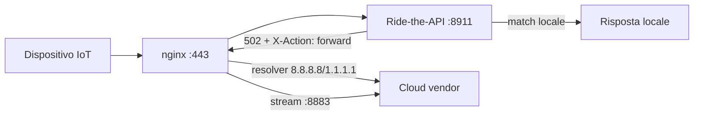

# Guida al Deployment — Ride-the-API

> Proxy di sostituzione cloud locale: intercetta il traffico IoT, impara i protocolli
> tramite LLM e risponde localmente.

## Indice

- [Esecuzione Diretta](#esecuzione-diretta-python-serverpy)
- [Docker](#docker)
- [Docker Compose con nginx Sidecar](#docker-compose-con-nginx-sidecar)
- [Volumi e Persistenza](#volumi-e-persistenza)
- [Reti](#reti)
- [Variabili d'Ambiente](#variabili-dambiente)
- [GPU Support](#gpu-support)
- [Systemd (Linux)](#systemd-linux)
- [Risoluzione dei Problemi](#risoluzione-dei-problemi)

---

## Esecuzione Diretta (`python -m core.server`)

Adatta per sviluppo o singolo host senza container.

### Prerequisiti

- Python ≥ 3.11
- Pip / uv
- Git

### Installazione

```bash
# Clona il repository
git clone https://github.com/thcuba/Ride-the-api.git
cd Ride-the-api

# Crea e attiva un ambiente virtuale
python3 -m venv .venv
source .venv/bin/activate  # Linux/macOS
# .venv\Scripts\activate   # Windows

# Installa il pacchetto in modalità editable
pip install -e .
```

### Configurazione

```bash
# Copia il file di configurazione di esempio
cp config/config.yaml config/config.yaml  # già presente

# Modifica config/config.yaml:
# - Imposta la chiave API LLM (OpenAI-compatible)
# - Configura i vendor e i loro endpoint cloud
# - Regola la modalità di apprendimento
```

Il file `config/config.yaml` segue la struttura documentata in [configurazione.md](configurazione.md).

### Avvio

```bash
python -m core.server
```

Il server si avvia su `http://0.0.0.0:8911` (configurabile in `config.yaml`).

### Setup DNS (obbligatorio per l'intercettazione)

Per intercettare il traffico dei dispositivi IoT, devi far puntare i loro domini cloud
all'indirizzo IP del proxy. Metodi consigliati:

#### dnsmasq

```bash
# /etc/dnsmasq.d/ride-api.conf
address=/mqtt.example.com/192.168.1.100
address=/api.example.com/192.168.1.100

sudo systemctl restart dnsmasq
```

#### Pi-hole / AdGuard Home

Aggiungi rewrite personalizzati:
```
mqtt.example.com → 192.168.1.100
api.example.com  → 192.168.1.100
```

#### iptables (alternativa)

Se non puoi modificare il DNS, reindirizza direttamente le porte:

```bash
iptables -t nat -A PREROUTING -d 192.168.1.100 -p tcp --dport 443 -j REDIRECT --to-port 8911
iptables -t nat -A PREROUTING -d 192.168.1.100 -p tcp --dport 8883 -j REDIRECT --to-port 8911
```

---

## Docker

### Build dell'immagine

```bash
# CPU (default)
docker build -f deploy/Dockerfile -t ride-the-api:latest .

# GPU (NVIDIA CUDA)
docker build --target=production-gpu -f deploy/Dockerfile -t ride-the-api:gpu .
```

Il Dockerfile multi-stage offre tre target:

| Target | Descrizione |
|--------|-------------|
| `base` | Dipendenze Python + compilazione |
| `gpu` | Base + CUDA 12.4, TensorRT, ONNX Runtime GPU |
| `production` | **(default)** Immagine minima di produzione (CPU) |
| `production-gpu` | Produzione con GPU |

### Esecuzione singolo container

```bash
# Crea directory per i dati persistenti
mkdir -p data/devices data/core certs models logs

# Avvia il container
docker run -d \
  --name ride-the-api \
  --restart unless-stopped \
  -p 8911:8911 \
  -p 8080:8080 \
  -v "$(pwd)/config:/app/config:ro" \
  -v "$(pwd)/data:/app/data" \
  -v "$(pwd)/certs:/app/certs:ro" \
  -v "$(pwd)/models:/app/models:ro" \
  -v "$(pwd)/logs:/app/logs" \
  -e LOG_LEVEL=INFO \
  -e CONFIG_PATH=/app/config/config.yaml \
  ride-the-api:latest
```

### Health check

Il container espone un health check automatico ogni 30 secondi su `http://localhost:8911/health`.

Porte esposte dal container:

| Porta | Uso |
|-------|-----|
| 8911 | Proxy principale (intercettazione traffico) |
| 8080 | Health check / dashboard |
| 9090 | Metriche Prometheus |

---

## Docker Compose con nginx Sidecar

L'architettura consigliata per la produzione prevede un reverse proxy nginx come sidecar.
nginx si occupa di:

1. Terminazione TLS (porta 443)
2. Routing del traffico dei dispositivi a Ride-the-API (porta 8911 interna)
3. Forward dei miss al cloud vendor tramite resolver DNS dedicato (8.8.8.8 / 1.1.1.1),
   **evitando loop DNS** con il DNS locale (dnsmasq / Pi-hole)

### Avvio

```bash
docker compose -f deploy/docker-compose.yml up -d
```

### Servizi

#### `ride-the-api` (server principale)

```yaml
ride-the-api:
  build:
    context: ..
    dockerfile: deploy/Dockerfile
  container_name: ride-the-api
  restart: unless-stopped
  ports:
    - "8080:8080"      # Health/dashboard (opzionale, rimuovere per sicurezza)
  volumes:
    - ../config:/app/config:ro
    - ../data:/app/data
    - ../certs:/app/certs:ro
    - ../models:/app/models:ro
    - ../logs:/app/logs
  environment:
    - PYTHONUNBUFFERED=1
    - LOG_LEVEL=INFO
    - CONFIG_PATH=/app/config/config.yaml
```

#### `nginx` (reverse proxy sidecar)

```yaml
nginx:
  image: nginx:alpine
  container_name: ride-the-api-nginx
  restart: unless-stopped
  ports:
    - "80:80"
    - "443:443"
    - "8883:8883"      # MQTT over TLS (stream proxy)
  volumes:
    - ../deploy/nginx.conf:/etc/nginx/nginx.conf:ro
    - ../certs:/etc/nginx/certs:ro
  depends_on:
    - ride-the-api
```

#### `postgres` (opzionale — database centralizzato)

Commentato nel docker-compose.yml di default. Abilitalo per usare PostgreSQL invece dei
database SQLite per-device:

```yaml
postgres:
  image: postgres:16-alpine
  environment:
    POSTGRES_DB: ride_the_api
    POSTGRES_USER: ride_the_api
    POSTGRES_PASSWORD: ${POSTGRES_PASSWORD}
  volumes:
    - postgres_data:/var/lib/postgresql/data
```

### Flusso del traffico con nginx



Quando Ride-the-API non riconosce una richiesta e `signal_forward_to_cloud` è abilitato,
restituisce HTTP 502 con header `X-Action: forward`. nginx intercetta l'errore e re-invia
la richiesta al cloud vendor utilizzando un resolver DNS dedicato (Google 8.8.8.8 /
Cloudflare 1.1.1.1), bypassando il DNS locale e prevenendo loop.

Vedi [nginx-architecture.md](nginx-architecture.md) per i dettagli architetturali.

---

## Volumi e Persistenza

| Path nel container | Descrizione | Consigliato |
|-------------------|-------------|-------------|
| `/app/config` | Configurazione YAML (montaggio read-only) | Bind mount `:ro` |
| `/app/data/devices` | Database SQLite per-dispositivo | Volume persistente |
| `/app/data/core` | Database centrale SQLite | Volume persistente |
| `/app/data/device_certs` | Certificati TLS generati per dispositivo | Volume persistente |
| `/app/certs` | Certificati CA e leaf (read-only) | Bind mount `:ro` |
| `/app/models` | Modelli ONNX pre-addestrati (read-only) | Bind mount `:ro` |
| `/app/logs` | Log dell'applicazione | Volume persistente |

Per Docker Compose, usa volumi nominati per i dati persistenti:

```yaml
volumes:
  ride_api_data:
  postgres_data:
```

Per produzione, assicurati che i certificati TLS e la CA siano montati in `/app/certs`
e che la configurazione sia valida prima di avviare.

---

## Reti

### Docker Compose (rete bridge)

Tutti i servizi condividono la rete `ride-the-api-net` (bridge). I servizi comunicano
tramite nome container:

- `nginx` → `ride-the-api:8911` (proxy interno)
- `ride-the-api` → `postgres:5432` (se abilitato)

```yaml
networks:
  ride-the-api-net:
    driver: bridge
```

### Esecuzione diretta

In esecuzione diretta (`python -m core.server`), il server ascolta su `0.0.0.0:8911`.
Assicurati che:

- Il firewall permetta il traffico in ingresso sulla porta configurata
- I dispositivi IoT possano raggiungere l'host (stessa subnet o routing configurato)
- Il DNS locale punti i domini cloud all'IP del proxy

### nginx e risoluzione DNS

nginx utilizza un resolver dedicato per evitare loop DNS:

```nginx
resolver 8.8.8.8 1.1.1.1 valid=300s ipv6=on;
```

| Provider | IPv4 | IPv6 |
|----------|------|------|
| Google | 8.8.8.8 | 2001:4860:4860::8888 |
| Cloudflare | 1.1.1.1 | 2606:4700:4700::1111 |

Per protocolli non-HTTP (CoAP, Modbus, custom), il modulo Python
`core/upstream_resolver.py` fornisce la stessa risoluzione dual-stack.

---

## Variabili d'Ambiente

Le seguenti variabili d'ambiente possono essere usate per sovrascrivere la configurazione
al runtime (utile in Docker/Kubernetes):

| Variabile | Default | Descrizione |
|-----------|---------|-------------|
| `PYTHONUNBUFFERED` | `1` | Flush immediato stdout/stderr |
| `LOG_LEVEL` | `INFO` | Livello di logging (DEBUG, INFO, WARNING, ERROR) |
| `CONFIG_PATH` | `config/config.yaml` | Percorso del file di configurazione |
| `OPENAI_API_KEY` | — | Chiave API per LLM OpenAI-compatible |
| `POSTGRES_PASSWORD` | — | Password PostgreSQL (solo con db centralizzato) |

---

## GPU Support

Ride-the-API supporta l'inferenza accelerata via GPU NVIDIA per modelli ONNX/TensorRT.

### Build GPU

```bash
docker build --target=production-gpu -f deploy/Dockerfile -t ride-the-api:gpu .
```

### Docker Compose (GPU)

Decommenta la sezione `deploy` nel docker-compose.yml:

```yaml
ride-the-api:
  deploy:
    resources:
      reservations:
        devices:
          - driver: nvidia
            count: 1
            capabilities: [gpu]
```

### Configurazione

Nel `config.yaml`, imposta l'execution provider su GPU:

```yaml
models:
  inference:
    execution_providers: ["CUDAExecutionProvider"]
```

### Prerequisiti host

- NVIDIA Container Toolkit installato (`nvidia-ctk` disponibile su PATH)
- Driver NVIDIA ≥ 525
- Per TensorRT: NVIDIA Container Toolkit con runtime `nvidia`

---

## Systemd (Linux)

Per esecuzione diretta come servizio systemd:

```ini
# /etc/systemd/system/ride-the-api.service
[Unit]
Description=Ride-the-API — Local Cloud Replacement Proxy
After=network.target network-online.target
Wants=network-online.target

[Service]
Type=simple
User=rideapi
Group=rideapi
WorkingDirectory=/opt/ride-the-api
Environment=PYTHONUNBUFFERED=1
Environment=LOG_LEVEL=INFO
Environment=CONFIG_PATH=/opt/ride-the-api/config/config.yaml
ExecStart=/opt/ride-the-api/.venv/bin/python -m core.server
Restart=always
RestartSec=5
StandardOutput=journal
StandardError=journal

# Hardening
ProtectSystem=full
ProtectHome=true
NoNewPrivileges=true
PrivateTmp=true
ReadWritePaths=/opt/ride-the-api/data /opt/ride-the-api/logs

[Install]
WantedBy=multi-user.target
```

```bash
sudo systemctl daemon-reload
sudo systemctl enable --now ride-the-api
sudo systemctl status ride-the-api
```

---

## Risoluzione dei Problemi

### Loop DNS

**Sintomo**: Le richieste non arrivano mai al cloud; il proxy si richiama da solo.

**Soluzione**: Abilita `signal_forward_to_cloud: true` in `config.yaml` e usa nginx come
sidecar con resolver 8.8.8.8/1.1.1.1.

### Certificati TLS non validi

**Sintomo**: I dispositivi rifiutano la connessione TLS.

**Soluzione**:
1. Installa il certificato CA su ogni dispositivo (disponibile via
   `/api/tls/ca-cert` sul proxy)
2. Verifica che `/app/certs/` contenga i certificati corretti
3. Per bypassare il certificate pinning, usa lo script Frida disponibile su
   `/api/tls/frida/script.js`

### Container non raggiungibile

**Sintomo**: `curl http://localhost:8911/health` fallisce.

**Soluzione**:
1. Verifica che il container sia in esecuzione: `docker ps`
2. Controlla i log: `docker logs ride-the-api`
3. Verifica le porte: `docker port ride-the-api`
4. La porta 8911 è interna alla rete Docker — in produzione si raggiunge solo tramite
   nginx sulla 443

### Database corrotto

**Sintomo**: Errori SQLAlchemy nei log.

**Soluzione**: I database SQLite per-dispositivo sono in `data/devices/`. Ferma il
server, sposta il database problematico, riavvia. Il proxy lo ricrea automaticamente.

---

## Riferimenti

- [Architettura](architettura.md) — componenti e flussi
- [nginx Architecture](nginx-architecture.md) — reverse proxy e prevenzione loop DNS
- [Configurazione](configurazione.md) — riferimento completo config.yaml
- [API Reference](api.md) — endpoint REST
- [Portable Pattern Database](portable-pattern-database.md) — formato .ride-pattern.json / .ride-capture.json